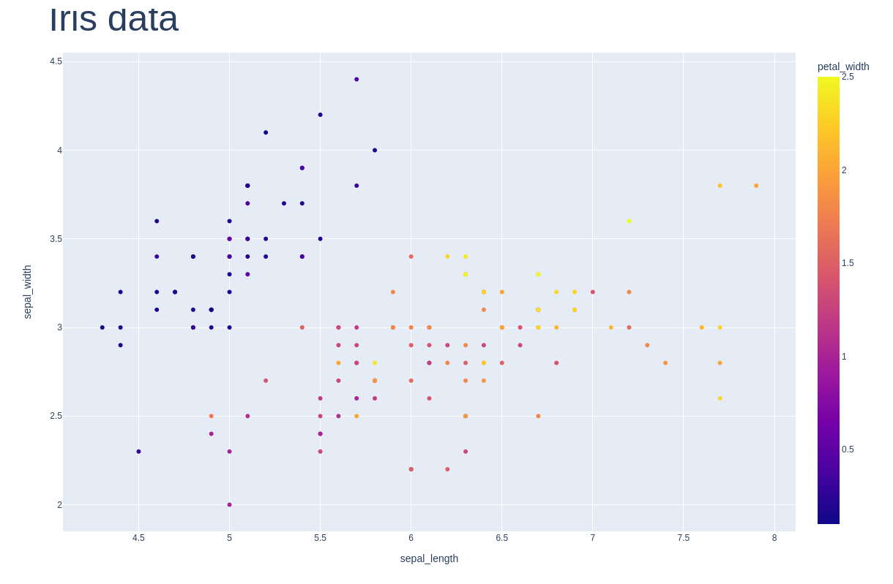

# plotly_tabular_tool - plotly.express wrapped as a Galaxy tool.

## Install to your Galaxy server from the toolshed - search for plotly_tabular_tool owned by fubar2

### Example interactive plots and more at https://lazarus.name/demo/

#### Non interactive screen grab of the tool output

Galaxy tool to create plotly interactive hover HTML plots from user selected columns of any Galaxy tabular data.

Plotly.express makes a lot of clever design decisions.
Unfortunately, it gets totally confused with evalue columns because it thinks scientific notation like 5.00e-204 is a string or something.
Strange and probably uninformative axes and plots will probably result if you try a blast evalue column without transformation.
Note that all columns used for colour (legend) and the x/y axis tickmarks are truncated because they can squish up the plot.
.. is added at the end to show truncation.

A specialised version for 25 column Galaxy blastn search outputs is also available. It uses this code mostly, but adds a default header and auto-transformation of the evalue column -log10(x) to make them more like the bitscore

## Tool made with the Galaxy ToolFactory: https://github.com/fubar2/galaxy_tf_overlay
The current release includes this and a generic tabular version, and a java .jar wrapper in a history where they can be rerun and in a workflow
where they can be regenerated if the input data sets are available.

